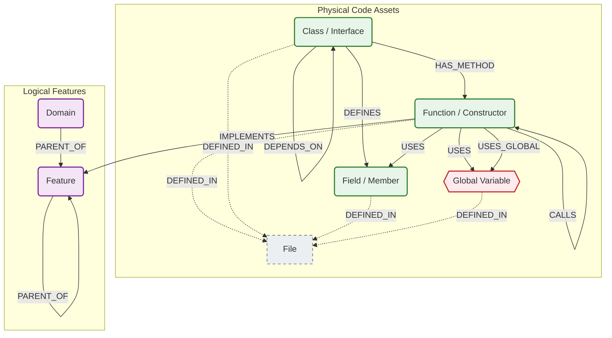
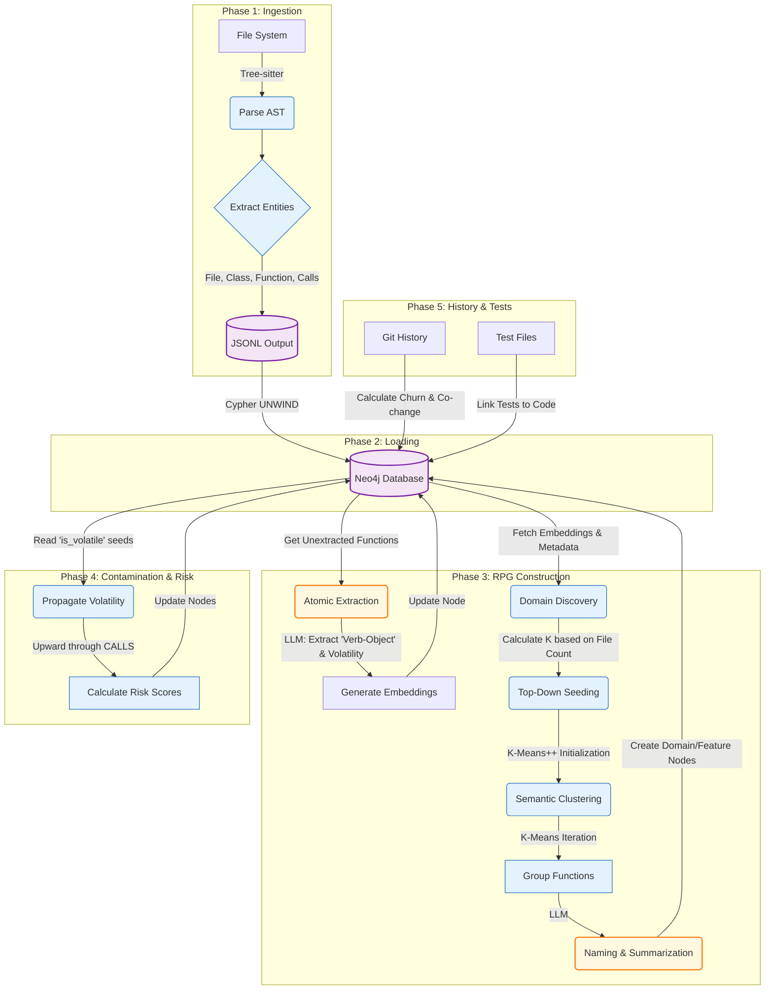

# GraphDB Skill Overview

## 1. Graph Schema Definition
In this project, the "schema" is not defined in a single SQL-like file because Neo4j is schemaless. Instead, the schema is the **contract** between the **Ingestion Pipeline** (Producers: `internal/analysis`, `internal/rpg`) and the **Query Engine** (Consumers: `internal/query/neo4j.go`).

The graph consists of two distinct layers:

### A. The Physical Layer (Code Structure)
Represents the actual code on disk. These nodes and edges are generated by the Tree-sitter parsers during the `ingest` phase.

*   **Nodes:**
    *   `File`: A physical file on disk.
    *   `Function`: A function or method definition.
    *   `Constructor`: Specifically identified for Java/C#.
    *   `Class`: A class, struct, or interface definition.
    *   `Interface`: Explicit label used in Java/TypeScript.
    *   `Field`: A member variable or property within a class.
    *   `Global`: A global variable or static field (state).

*   **Edges:**
    *   `(:Class|:Interface)-[:HAS_METHOD]->(:Function|:Constructor)`: Structural ownership.
    *   `(:Class|:Interface)-[:DEFINES]->(:Field)`: Structural ownership of fields.
    *   `(:Function)-[:CALLS]->(:Function|:Constructor)`: Direct function/method invocation.
    *   `(:Function)-[:USES]->(:Field|:Global)`: Field or Global state access.
    *   `(:Function)-[:USES_GLOBAL]->(:Global)`: Represents code reading/writing global state (Supported in backend; parser implementation varies).
    *   `(:Class)-[:EXTENDS|INHERITS|IMPLEMENTS]->(:Class|:Interface)`: Inheritance relationships.
    *   `(:Class)-[:DEPENDS_ON]->(:Class|:Interface)`: Type-level dependency (e.g., parameter types).
    *   `(*)-[:DEFINED_IN]->(:File)`: Links all code entities to their source file.

### B. The Intent Layer (Repository Planning Graph - RPG)
Represents the architectural "why". The RPG framework bridges high-level user intent with low-level code implementation (based on the "Repository Planning Graph" research). These nodes are generated by the RPG Builder (`internal/rpg`).

*   **Nodes:**
    *   `Domain`: Top-level semantic grouping (ID starts with `domain-`).
    *   `Feature`: Logical grouping of code (e.g., "User Authentication").

*   **Edges:**
    *   `(:Domain|:Feature)-[:PARENT_OF]->(:Feature)`: Hierarchical composition.
    *   `(:Function)-[:IMPLEMENTS]->(:Feature)`: Links the physical code to the logical feature it supports.

---

## 2. Visual Representation

## 3. Key Concepts & Edge Logic

*   **Global State Tracking & Variable Access (`USES_GLOBAL` / `USES`):**
    *   **Backend Status:** The backend queries (e.g., `globals`, `what-if`) fully support and utilize these edges to track shared state and dependencies.
    *   **Parser Status & Technical Limitation:** On the ingestion side, extracting `Field` nodes (`DEFINES` edge) is supported across languages (Java, TS, C++). However, emitting the behavioral `USES` and `USES_GLOBAL` edges is currently **only implemented in the C++ parser**.
    *   **The AST vs. Compiler Constraint:** Because the ingestion pipeline uses Tree-sitter (syntactic analysis) rather than a full compiler frontend (semantic analysis), accurately resolving variable access in heavily object-oriented languages like Java and TypeScript is extremely difficult. It requires building complex lexical scope chains to handle variable shadowing (e.g., distinguishing a local `count` from `this.count`) and cross-boundary type inference (`order.getStatus()`). The C++ parser uses a flatter symbol-matching heuristic, but extending this accurately to Java/TS is a known limitation that would likely require LSP integration.

*   **Feature Mapping (`IMPLEMENTS`):**
    *   **Definition:** Links physical `Function` nodes to high-level logical `Feature` nodes.
    *   **Usage:** This allows queries like `explore-domain` to find all contributing functions for a concept (e.g., "Auth"), even if scattered across different files.

*   **Seams & Risks:**
    *   The `impact` and `seams` queries rely on the `CALLS` graph to calculate "Contamination". If a function touches a UI component or a database, that "risk" propagates up the `CALLS` edges to its callers.
    *   **Pinch Points (Structural Seams):** A "chokepoint" sitting between stable business logic and volatile dependencies (UI, DB, APIs).
        *   **Logic:** Identified by high *Internal Fan-In* (non-volatile callers) and high *Volatile Fan-Out* (volatile callees).
        *   **Implementation:** Backend Cypher query (`internal/query/neo4j.go`). 
        *   **Threshold:** `internal_fan_in > 0 AND volatile_fan_out > 0`. Results are ranked by `Fan-In * Fan-Out`.
    *   **Semantic Seams (Divergence Seams):** Identifies SRP violations within a container (File/Class) by finding function pairs with low semantic similarity.
        *   **Logic:** Uses Cosine Similarity between vector embeddings.
        *   **Implementation:** Backend Cypher query (`internal/query/neo4j_semantic_seams.go`).
        *   **Threshold:** `similarity < 0.5` (CLI default) or `0.6` (UI default).

---

## 4. The Ingestion Pipeline

The transition from raw code to a queryable knowledge graph occurs in distinct phases. This process combines static analysis, vector embeddings, and LLM-driven semantic clustering.

### Phase 1: Ingestion (Parsing)
*   **Command:** `graphdb ingest` walks the file system in parallel.
*   **Parsing:** Uses **Tree-sitter** to generate Concrete Syntax Trees.
*   **Graph Construction:** Extracts structural entities (`File`, `Class`, `Function`, `Field`, `Global`) and their local relationships.
*   **Output:** Generates a stream of JSONL files representing the physical graph.

### Phase 2: Loading (Persistence)
*   **Command:** `graphdb import` reads the generated JSONL stream.
*   **Batching:** Uses Cypher `UNWIND` for high-throughput transactional inserts into Neo4j.

### Phase 3: RPG Construction (Repository Planning Graph)
*   **Command:** `graphdb enrich --step all` (or individual steps)
*   **Process:**
    1.  **Atomic Extraction (`--step extract`):** Iterates over functions. Uses an LLM to extract "Verb-Object" descriptors and **seeds initial volatility flags** (e.g., identifies if a function interacts with the DB or UI).
    2.  **Embedding Generation:** Vectorizes the entire function body (or signature) using `gemini-embedding-001` (768 dimensions) and stores it on the Neo4j node.
    3.  **Clustering Initialization (Seeding) (`--step features`):** 
        *   Calculates the target number of Top-Level Domains (K) based on the unique file count (capped at 50 domains).
        *   Uses **K-Means++** to deterministically select the optimal initial centroids ("seeds") for the clusters. This is the computationally heavy `Seeding X/Y` step seen in the CLI.

        > **Plain English:** Think of "seeding" as picking the starting points for each logical group. If you pick starting points that are too close together, your groups will overlap and become messy. K-Means++ is a smart algorithm that ensures these initial "seeds" are spread out as far as possible from each other across the semantic space of your code. By picking seeds that are mathematically "distant" (e.g., one in networking, one in UI, one in database logic), the final clusters are much more likely to represent distinct, high-quality architectural domains.
    4.  **Semantic Clustering:** Runs the K-Means algorithm to group functions with similar vector embeddings into logical `Feature` and `Domain` clusters.
    5.  **Naming & Summarization:** Passes the grouped functions to the LLM to generate concise, human-readable names and descriptions for the newly created `Feature` and `Domain` nodes.

### Phase 4: Contamination Analysis (Seams)
*   **Command:** `graphdb enrich-contamination`
*   **Logic:** Reads the `is_volatile` flags seeded by the LLM during Phase 3, and propagates them upward through the `CALLS` graph. Calculates a normalized `risk_score` for every function based on its transitive dependencies on volatile code.

### Phase 5: History & Test Enrichment
*   **Commands:** `graphdb enrich-history` and `graphdb enrich-tests`
*   **Process:**
    1.  **Churn:** Analyzes git logs to set `change_frequency` on `File` nodes.
    2.  **Co-change:** Identifies files that frequently change together.
    3.  **Tests:** Explicitly links `is_test` functions to the production code they exercise.
