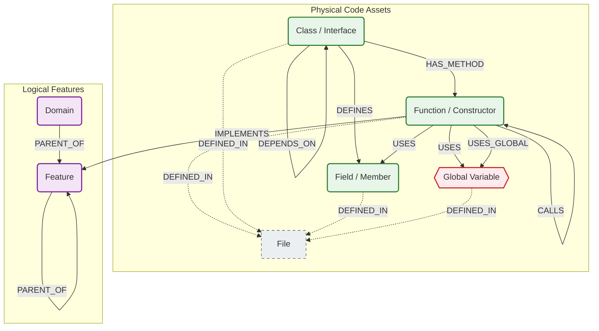
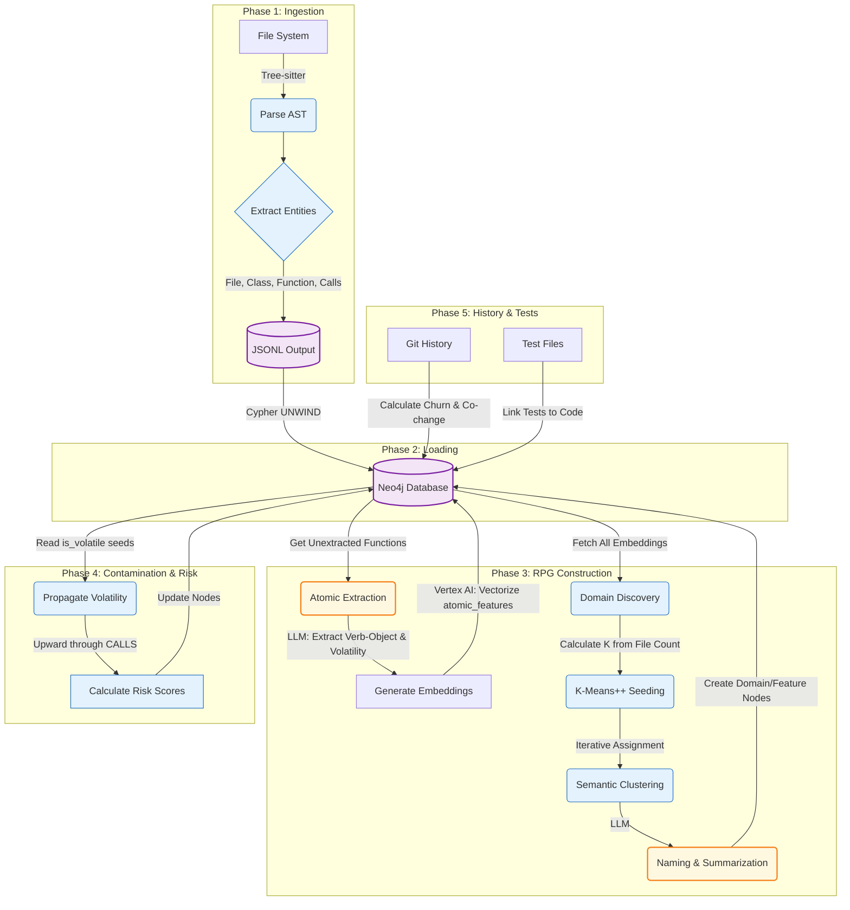

# GraphDB Skill Overview

## 1. Graph Schema Definition
In this project, the "schema" is not defined in a single SQL-like file because Neo4j is schemaless. Instead, the schema is the **contract** between the **Ingestion Pipeline** (Producers: `internal/analysis`, `internal/rpg`) and the **Query Engine** (Consumers: `internal/query/neo4j.go`).

The graph consists of two distinct layers:

### A. The Physical Layer (Code Structure)
Represents the actual code on disk. These nodes and edges are generated by the Tree-sitter parsers during the `ingest` phase.

*   **Nodes:**
    *   `File`: A physical file on disk.
    *   `Function`: A function or method definition.
    *   `Constructor`: Specifically identified for Java/C#.
    *   `Class`: A class, struct, or interface definition.
    *   `Interface`: Explicit label used in Java/TypeScript.
    *   `Field`: A member variable or property within a class.
    *   `Global`: A global variable or static field (state).

*   **Edges:**
    *   `(:Class|:Interface)-[:HAS_METHOD]->(:Function|:Constructor)`: Structural ownership.
    *   `(:Class|:Interface)-[:DEFINES]->(:Field)`: Structural ownership of fields.
    *   `(:Function)-[:CALLS]->(:Function|:Constructor)`: Direct function/method invocation.
    *   `(:Function)-[:USES]->(:Field|:Global)`: Field or Global state access.
    *   `(:Function)-[:USES_GLOBAL]->(:Global)`: Represents code reading/writing global state (Supported in backend; parser implementation varies).
    *   `(:Class)-[:EXTENDS|INHERITS|IMPLEMENTS]->(:Class|:Interface)`: Inheritance relationships.
    *   `(:Class)-[:DEPENDS_ON]->(:Class|:Interface)`: Type-level dependency (e.g., parameter types).
    *   `(*)-[:DEFINED_IN]->(:File)`: Links all code entities to their source file.

### B. The Intent Layer (Repository Planning Graph - RPG)
Represents the architectural "why". The RPG framework bridges high-level user intent with low-level code implementation (based on the "Repository Planning Graph" research). These nodes are generated by the RPG Builder (`internal/rpg`).

*   **Nodes:**
    *   `Domain`: Top-level semantic grouping (ID starts with `domain-`).
    *   `Feature`: Logical grouping of code (e.g., "User Authentication").

*   **Edges:**
    *   `(:Domain|:Feature)-[:PARENT_OF]->(:Feature)`: Hierarchical composition.
    *   `(:Function)-[:IMPLEMENTS]->(:Feature)`: Links the physical code to the logical feature it supports.

---

## 2. Visual Representation



## 3. Key Concepts & Edge Logic

*   **Global State Tracking & Variable Access (`USES_GLOBAL` / `USES`):**
    *   **Backend Status:** The backend queries (e.g., `globals`, `what-if`) fully support and utilize these edges to track shared state and dependencies.
    *   **Parser Status & Technical Limitation:** On the ingestion side, extracting `Field` nodes (`DEFINES` edge) is supported across languages (Java, TS, C++). However, emitting the behavioral `USES` and `USES_GLOBAL` edges is currently **only implemented in the C++ parser**.
    *   **The AST vs. Compiler Constraint:** Because the ingestion pipeline uses Tree-sitter (syntactic analysis) rather than a full compiler frontend (semantic analysis), accurately resolving variable access in heavily object-oriented languages like Java and TypeScript is extremely difficult. It requires building complex lexical scope chains to handle variable shadowing (e.g., distinguishing a local `count` from `this.count`) and cross-boundary type inference (`order.getStatus()`). The C++ parser uses a flatter symbol-matching heuristic, but extending this accurately to Java/TS is a known limitation that would likely require LSP integration.

*   **Feature Mapping (`IMPLEMENTS`):**
    *   **Definition:** Links physical `Function` nodes to high-level logical `Feature` nodes.
    *   **Usage:** This allows queries like `explore-domain` to find all contributing functions for a concept (e.g., "Auth"), even if scattered across different files.

*   **Seams & Risks:**
    *   The `impact` and `seams` queries rely on the `CALLS` graph to calculate "Contamination". If a function touches a UI component or a database, that "risk" propagates up the `CALLS` edges to its callers.
    *   **Pinch Points (Structural Seams):** A "chokepoint" sitting between stable business logic and volatile dependencies (UI, DB, APIs).
        *   **Goal:** Find the perfect place to introduce an interface or mock when wrapping legacy code in tests.
        *   **Logic:** Identified by high **Internal Fan-In** (callers that are non-volatile/safe) and high **Volatile Fan-Out** (callees that are volatile/interact with external systems).
        *   **Implementation:** Backend Cypher query (`internal/query/neo4j.go`) that finds functions matching both criteria.
        *   **Ranking:** Results are ranked by a risk score calculated as `(internal_fan_in * volatile_fan_out)`. High scores indicate critical chokepoints.
    *   **Semantic Seams (Divergence Seams):** Identifies SRP (Single Responsibility Principle) violations within a container (File/Class) by finding function pairs with low semantic similarity.
        *   **Goal:** Identify files or classes that do too many unrelated things and should be split.
        *   **Logic:** Compares every pair of functions within the same `File` or `Class` using **Cosine Similarity** between their vector embeddings.
        *   **Implementation:** Backend Cypher query (`internal/query/neo4j_semantic_seams.go`).
        *   **Threshold:** Flags pairs where `similarity < 0.5` (CLI default) or `0.6` (UI default). A near-zero similarity suggests the two functions belong in different architectural domains.

---

## 4. The Ingestion Pipeline

The transition from raw source code to a queryable knowledge graph occurs in six phases. Each phase has a single responsibility and a clear data contract with the next.

**Guiding Principles:**
*   **Separation of concerns:** Structural parsing (deterministic, fast, offline) is strictly separated from semantic enrichment (LLM-driven, expensive, requires GCP credentials). Phase 1 requires no API calls or cloud credentials.
*   **Idempotent and resumable:** Each phase can be re-run without corrupting the graph. Database-backed loops skip already-processed nodes, allowing safe resumption after failures.
*   **Parse, persist, then enrich:** Raw structure is committed to the database before any semantic analysis begins. This ensures the structural graph is always complete and consistent, independent of LLM availability.

```
Phase 1 (Ingest) --> JSONL --> Phase 2 (Import) --> Neo4j --> Phase 3 (RPG) --> Neo4j --> Phase 4 (Contamination) --> Neo4j --> Phase 5 (History/Tests) --> Neo4j
```



### Phase 1: Ingestion (Structural Parsing)

*   **Command:** `graphdb ingest -dir <path>`
*   **Input:** A directory of source code files
*   **Output:** JSONL files containing nodes and edges (the physical layer)
*   **Dependencies:** None. This phase is entirely offline -- no API calls, no database, no cloud credentials.

**What it does:**

1.  Walks the file system, respecting `.gitignore` patterns at every directory level.
2.  Dispatches files to a concurrent worker pool (configurable via `-workers`).
3.  Each worker selects a **Tree-sitter** parser by file extension and generates a Concrete Syntax Tree.
4.  Extracts structural entities: `File`, `Class`, `Interface`, `Function`, `Constructor`, `Field`, `Global`.
5.  Extracts behavioral edges: `CALLS`, `USES`, `HAS_METHOD`, `DEFINES`, `EXTENDS`, `IMPLEMENTS`, `DEPENDS_ON`.
6.  Links every entity to its source file via `DEFINED_IN` edges.
7.  Tags test files and their contained functions with `is_test: true` (used later by Phase 5 test enrichment).
8.  Serializes all nodes and edges to JSONL.

**Why it is separate from import:** Decoupling parsing from database writes allows the JSONL output to be versioned, inspected, diffed, or re-imported without re-parsing. For large codebases, parsing is CPU-bound (Tree-sitter) while import is I/O-bound (Neo4j transactions), so they benefit from independent scaling and failure isolation.

**Why no embeddings are generated here:** Embedding generation requires the semantic context produced by LLM extraction (Phase 3a). Generating embeddings from bare function names like `handleRequest` produces low-fidelity vectors that degrade downstream clustering and seam detection. By deferring all embedding work to Phase 3, the pipeline ensures vectors are always based on rich LLM-extracted descriptors like `parse-http-headers, validate-auth-token, route-request`.

### Phase 2: Loading (Graph Persistence)

*   **Command:** `graphdb import -nodes <path> -edges <path>`
*   **Input:** JSONL files from Phase 1
*   **Output:** A populated Neo4j database with the complete physical layer
*   **Dependencies:** Running Neo4j instance

**What it does:**

1.  Creates schema constraints and indexes: uniqueness constraints on node IDs, vector indexes for embeddings (cosine similarity on `Function.embedding` and `Feature.embedding`, dimensions configurable via `GEMINI_EMBEDDING_DIMENSIONS`).
2.  Reads JSONL streams and batches records for high-throughput insertion.
3.  Uses Cypher `UNWIND` patterns for transactional bulk writes (configurable batch sizes).

**Why UNWIND:** Neo4j's `UNWIND` pattern allows a single transaction to create hundreds of nodes/edges from a parameterized list, amortizing the transaction overhead. This is 10-100x faster than individual `CREATE` statements and critical for codebases with hundreds of thousands of nodes.

**Incremental mode:** Note that incremental ingestion is handled by the `graphdb ingest` command (Phase 1), not by `import`. When run with `-since-commit` (or auto-detected from stored graph state via `GetGraphState()`), the ingest command skips JSONL output and upserts changed nodes directly into Neo4j using a `Neo4jEmitter`, effectively merging Phases 1 and 2 for changed files only.

### Phase 3: RPG Construction (Semantic Enrichment)

*   **Command:** `graphdb enrich-features`
*   **Input:** A populated Neo4j graph from Phase 2
*   **Output:** Enriched function nodes (atomic features, volatility flags, embeddings) + new topology (`Domain` and `Feature` nodes with `PARENT_OF` and `IMPLEMENTS` edges)
*   **Dependencies:** GCP credentials, Vertex AI (Gemini for LLM extraction + embedding generation)

This is the most complex phase. It runs four sub-steps sequentially, each building on the output of the previous. All sub-steps operate through resumable database-backed loops: they query for unprocessed nodes, process a batch, write results back, and repeat until no unprocessed nodes remain.

#### Sub-step 3a: Atomic Feature Extraction (`RunExtraction`)

*   Queries for `Function` nodes lacking `atomic_features` (resumable -- skips already-extracted nodes).
*   For each function, slices the actual source code from disk (using the stored `file`, `start_line`, `end_line` properties) and sends it to a generative LLM (e.g., Gemini).
*   The LLM returns structured JSON: `{"descriptors": ["verb-object", ...], "is_volatile": true/false}`
    *   **Descriptors** are semantic "verb-object" pairs (e.g., `authenticate-user`, `query-database-records`) that capture what the function actually does, independent of its name.
    *   **`is_volatile`** indicates whether the function interacts with external systems: UI rendering, database I/O, network calls, file system operations, or non-deterministic state. This flag seeds Phase 4 contamination analysis.
*   Both properties are persisted on the `Function` node in Neo4j.

**Why verb-object descriptors over raw names:** Raw function names like `handleRequest` carry minimal semantic signal. An LLM reading the implementation produces descriptors like `parse-http-headers, validate-auth-token, route-request`, which capture the function's actual responsibilities. These descriptors are the text that gets vectorized in the next sub-step, so their quality directly determines the quality of all downstream semantic operations (clustering, seam detection, vector search).

**Handling Complex/Legacy Functions:** When dealing with massive "God functions" typical in legacy codebases, granularity is preserved through three mechanisms:
1.  **Multiple Descriptors:** The LLM is instructed to generate 1-5 descriptors per function depending on its complexity. A massive `ProcessOrder()` function might return `["payment validation", "email notification", "inventory update"]`. When vectorized, this function sits precisely at the intersection of those concepts in the semantic space, rather than being forced into a single generic bucket.
2.  **Object-Action Priority:** The prompt strictly enforces a Domain-First (Noun-Verb) format (e.g., "payment validation", not "validate payment"). This ensures clustering algorithms group functions by *what business entity they touch* rather than generic technical actions (like grouping all "validation" functions together).
3.  **Truncation Limitation:** To respect LLM context limits, functions exceeding 4,000 characters are truncated. While this is a constraint, the top of a legacy function (parameters, early setup, massive switch statements) typically contains the most important structural clues regarding its primary responsibilities anyway.

**Why LLM-driven volatility:** Volatility detection determines which functions touch external systems. Previous approaches used regex heuristics (e.g., matching `Database` in function names), which were brittle, language-specific, and missed indirect side effects. The LLM evaluates the actual code behavior, generalizing across all supported languages.

#### Sub-step 3b: Embedding Generation (`RunEmbedding`)

*   Queries for nodes where `n.embedding IS NULL` (matches both `Function` and `Feature` nodes; resumable).
*   Converts each node to text via `NodeToText()`, which prioritizes `atomic_features` (from sub-step 3a), falling back to the raw `name` property, then the node ID.
*   Sends text batches to the configured embedding model (default: `gemini-embedding-001`), producing float32 vectors (dimensions configurable, default 768).
*   Writes each vector to the node's `embedding` property.

**Why this ordering is critical:** Extraction MUST complete before embedding. `NodeToText()` encodes the rich `atomic_features` text, not the bare function name. If extraction hasn't run, `NodeToText()` falls back to the raw name, producing the same low-fidelity vectors that would degrade clustering and seam detection.

#### Sub-step 3c: Semantic Clustering (`RunClustering`)

*   **Idempotent cleanup:** Clears any existing `Feature` and `Domain` topology (`ClearFeatureTopology`) before regenerating. This ensures re-runs produce exactly one set of clusters, not duplicates.
*   Loads all embeddings from the graph via `GetEmbeddingsOnly()`.
*   Calculates the target number of top-level domains: `K = sqrt(fileCount / 5)`, bounded to the range [5, 50].
*   Runs **K-Means++** initialization to select optimal initial centroids ("seeds").
*   Runs iterative K-Means assignment until convergence, grouping functions into clusters.
*   Creates `Domain` and `Feature` nodes in Neo4j, linked via `PARENT_OF` edges. Links constituent functions via `IMPLEMENTS` edges.
*   Sends each cluster's function list to the LLM for human-readable naming (e.g., "Authentication & Session Management").

**Why K-Means++ seeding:** Standard K-Means is sensitive to initial centroid placement. If starting points are too close together, clusters overlap and produce incoherent domains. K-Means++ ensures seeds are maximally spread across the semantic space -- one in networking, one in UI, one in database logic -- so the final clusters represent distinct architectural concerns. This is the computationally heavy "Seeding X/Y" step visible in the CLI.

**Why fail-fast on LLM errors:** If the LLM fails during cluster naming, the process halts with an explicit error rather than generating placeholder names like `Domain-<UUID>`. Silent fallbacks hide integration issues (quota exhaustion, timeouts) and produce an inconsistent graph state.

#### Sub-step 3d: Summarization (`RunSummarization`)

*   Queries for `Feature` and `Domain` nodes lacking a `description` property.
*   For each, loads the constituent functions and sends them to the LLM for a paragraph-length summary describing the cluster's architectural role.
*   Writes the summary to the node's `description` property.

### Phase 4: Contamination Analysis (Risk Propagation)

*   **Command:** `graphdb enrich-contamination`
*   **Input:** A graph with `is_volatile` flags on Function nodes (from Phase 3a)
*   **Output:** `is_volatile` propagated transitively through the call graph; `volatility_score` (distance-based); `risk_score` (composite, normalized) on every Function node
*   **Dependencies:** Running Neo4j instance (no LLM needed -- this is a pure graph algorithm)

**What it does:**

1.  **Pre-flight check:** Verifies that `is_volatile` flags exist in the graph. If zero volatile functions are found, halts with a directive to run `graphdb enrich-features` first.
2.  **Binary propagation:** Walks the `CALLS` graph upward. If function A calls any volatile function (directly or transitively), A is also marked `is_volatile = true`. This is a boolean flood-fill, not a scored propagation.
3.  **Volatility scoring:** Calculates a distance-based `volatility_score` for each function: `1.0 / (distance + 1)` where `distance` is the shortest path to any volatile function (0 = directly volatile, 1 = one hop away, etc.).
4.  **Composite risk scoring:** Computes a normalized `risk_score` combining four factors: `fan_in * 0.4 + fan_out * 0.1 + volatility_score * 3.0 + churn * 0.4`. The result is normalized to `[0, 1]` by dividing by the maximum observed score. A value of `1.0` means highest overall risk across all factors, not necessarily directly volatile.

**Why this is separate from Phase 3:** Contamination is a deterministic graph algorithm, not an LLM task. It runs in seconds, costs nothing, and can be re-run cheaply after any graph change (e.g., after re-ingesting code that adds new `CALLS` edges) without re-running expensive LLM extraction or embedding.

### Phase 5: History & Test Enrichment

*   **Commands:** `graphdb enrich-history -dir <path>` and `graphdb enrich-tests`
*   **Input:** Git repository + Neo4j graph
*   **Output:** Temporal and testing metadata on graph nodes
*   **Dependencies:** Git repository (for history), Running Neo4j instance

**What it does:**

1.  **Churn (`enrich-history`):** Analyzes `git log` output to compute per-file `change_frequency` on `File` nodes. High-churn files are candidates for refactoring.
2.  **Co-change (`enrich-history`):** Identifies files that frequently change together in the same commits. This reveals implicit coupling not visible in the structural graph (e.g., a config file that always changes alongside a service class).
3.  **Test linking (`enrich-tests`):** Identifies functions tagged `is_test: true` (from Phase 1) and matches them to production functions by naming convention (e.g., `TestFoo` links to `Foo`, `FooTest` links to `Foo`). Creates explicit `TESTS` edges via `MERGE`, enabling test coverage queries.

### One-Shot Pipeline

*   **Command:** `graphdb build-all -dir <path>`
*   **What it does:** Runs all six phases in sequence: Ingest, Import, Enrich Features, Enrich History, Enrich Contamination, Enrich Tests. Intermediate JSONL files are cleaned up after import.
*   **Use `-clean` flag** to wipe the Neo4j database before import, ensuring a fresh graph with no stale data.
